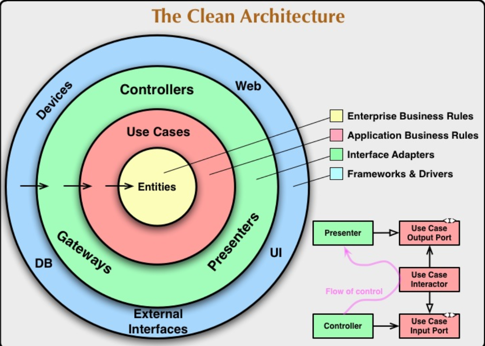
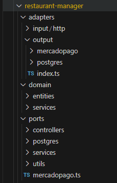
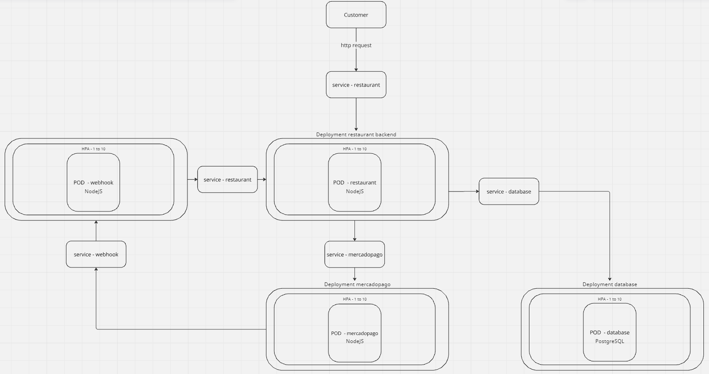
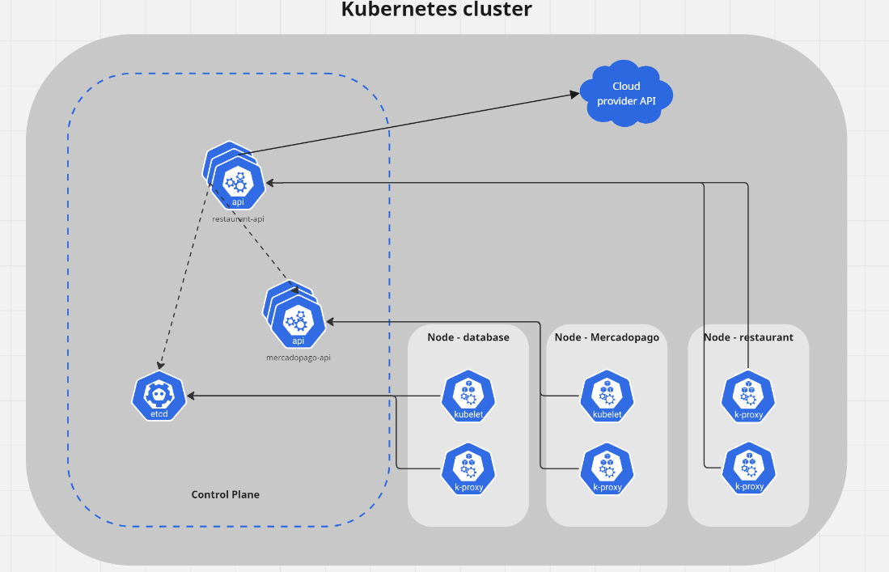

# Snack Bar System - Group 23

This is an academic project developed for the postgraduate [Software Architecture course](https://postech.fiap.com.br/curso/software-architecture/) in FIAP.

The developed project is a microsservice solution for managing snack bars, aiming for a self-service solution for customers. This solution uses Node.Js with typescript and PostgreSQL for storage and the deployment and orchestration is managed by Docker and Kubernetes.

## The Problem
*There is a neighborhood snack bar that is expanding due to its great success. However, with the expansion and without an order control system, customer service can become chaotic and confusing. For example, imagine a customer places a complex order, such as a customized hamburger with specific ingredients, accompanied by fries and a drink. The attendant might write down the order on a piece of paper and deliver it to the kitchen, but there is no guarantee that the order will be prepared correctly.*

*Without an order control system, there can be confusion between the attendants and the kitchen, resulting in delays in preparing and delivering orders. Orders may be lost, misinterpreted, or forgotten, leading to customer dissatisfaction and loss of business.*

*In summary, an order control system is essential to ensure that the snack bar can efficiently serve customers by properly managing their orders and inventory. Without it, expanding the snack bar may not work out, resulting in dissatisfied customers and negatively impacting the business.*

*To solve the problem, the snack bar will invest in a fast food self-service system, which consists of a series of devices and interfaces that allow customers to select and place orders without needing to interact with an attendant.*

— Source: [FIAP](https://postech.fiap.com.br/curso/software-architecture)

## Architecture
This project utilizes hexagonal architecture following clean code standards
to isolate the application's models, domains, and business rules from the input and output interfaces and their specificities.




- **adapters** represents the **frameworks & drivers**;
- **domain/entities** represents the **enterprise business rules**;
- **domain/services** represents the **application business rules**;
- **ports** represents the **interface Adapters**.

## Architecture drawing
A representation of the architectural design. one of the flows that communicates with all image services is the payment flow.

Payment flow is done via Mercadopago. The restaurant API, when creating the order, sends the information to Mercadopago which generates a QRCode and payment ID. When the payment is made, Mercadopago triggers an event to the weebhook with the payment ID paid, the webhook makes a request to the restaurant api that updates the order status to received based on the payment ID.



## Kubernetes infrastructure
The entire infrastructure is configured in Docker Kubernetes. Containing scalability with increasing and decreasing Pods automatically.




## Demonstration video

youtube.link

## Requirements
- Docker Desktop v25.0.3;
- Node.js v20.13.0;
- Kubernetes v1.29.1.

## Getting Started
### Docker
1. Run this command in root directory to build and run the apps:

```bash
docker-compose up
```

2. The aplication will be running on port: `8080`

3. To access swagger and test the endpoint, use the route `/api-docs` (http://localhost:8080/api-docs)

4. Run this command in root directory to stops and removes the container:

```bash
docker-compose down
```
### Kubernetes
1. Run this command in root directory to build and run the apps:

```bash
kubectl apply -f deployments/
```

2. The aplication will be running on port: `30001`

3. To access swagger and test the endpoint, use the route `/api-docs` (http://localhost:30001/api-docs)
